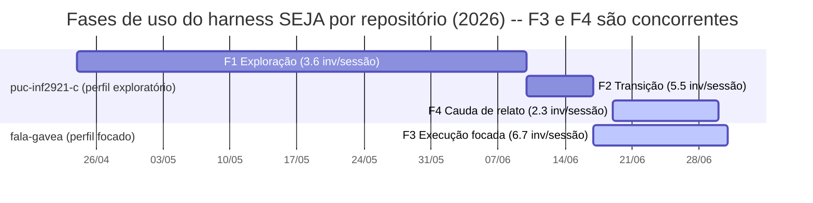

# Figura: timeline das fases da pesquisa 000087 em faixas paralelas

- **Data:** 2026-07-06
- source: research-000087 -- follow-up UX figura de timeline
- source: plan-000088 Step 3

A figura representa as 4 fases da pesquisa 000087 ("Perfis de uso do harness: exploratório vs focado") como faixas temporais, com os dois repositórios como **trilhas paralelas**. As fases não formam uma linha do tempo global única: F3 (fala-gavea) e F4 (puc-inf2921-c) ocorrem **nas mesmas semanas**, em repositórios distintos -- este é o controle intra-sujeito que sustenta o argumento causal central da pesquisa. Datas e métricas conferidas contra research-000087 (§Resultados por fase, §Achado central) e contra os números verificados em `_output/tmp/taxonomia-support-counts.md` (corpus congelado, cutoff <= 30/jun/2026 no repo pai).

## Figura (Mermaid gantt)

## Legenda

- **Trilha superior** (`puc-inf2921-c`): repositório-pai, perfil exploratório -- protótipos e acúmulo de conhecimento sobre domínio e problema. Contém F1 (exploração), F2 (transição, quando protótipos do fala-gavea ainda viviam no repo pai) e F4 (cauda de relato -- o harness usado como arquivo consultável para escrever material externo).
- **Trilha inferior** (`fala-gavea`): repositório dedicado (submodule), perfil focado -- implementação de uma solução para um projeto bem definido. Contém F3 (execução focada).
- **Faixas destacadas** (`active`): F3 e F4 -- o par temporalmente sobreposto que constitui o controle intra-sujeito. A janela de F4 (19-30/jun) está inteiramente contida na janela de F3 (17/jun-1/jul).
- Cortes de fase ancorados em eventos (post hoc): fim de F1 = última entrada gavealab-poc pura (10/jun); início de F3 = bootstrap do repo dedicado (plan-000072, 17/jun). Ano de referência: 2026.

## Versão textual (fallback acessível)

Para renderizadores sem suporte a Mermaid e para leitores de tela -- a figura não é o único portador da informação:

| Período (2026) | Fase | Repositório | Perfil | Invocações | Inv/sessão | Top skills |
|---|---|---|---|---|---|---|
| 24/abr - 10/jun | F1 Exploração | puc-inf2921-c | exploratório | 25 | 3.6 | implement 48%, plan 28%, advise 12% |
| 10/jun - 17/jun | F2 Transição | puc-inf2921-c | exploratório -> focado | 55 | 5.5 | plan 44%, implement 35%, research 13% |
| 17/jun - 1/jul | F3 Execução focada | fala-gavea | focado | 120 | 6.7 | plan 34%, implement 25%, research 22% |
| 19/jun - 30/jun | F4 Cauda de relato | puc-inf2921-c | relato | 16 | 2.3 | research 31%, communicate 25%, plan 19% |

Sobreposição temporal: F3 (17/jun-1/jul, fala-gavea) e F4 (19-30/jun, puc-inf2921-c) transcorrem nas mesmas semanas; F1, F2 e F4 são sequenciais dentro do repo pai, enquanto F3 corre em paralelo no repo dedicado a partir de 17/jun.

## Leitura

> A sobreposição temporal F3 || F4 -- mesmo desenvolvedor, mesma versão do harness, mesmas semanas, perfis opostos (6.7 vs 2.3 inv/sessão) -- é o que permite afirmar que **o tipo de tarefa molda a forma do fluxo**, em vez de atribuir a diferença entre perfis a maturidade ou tempo de uso, que são confundidores colineares entre F1 e F3.

---

> Passe de privacidade (LGPD, Rec 3 research-000087, plan-000088 Step 4, 2026-07-06): aprovado -- exemplos referenciam artefatos por ID; nenhum nome de colega, citação verbatim de brief/reflection/WhatsApp ou conteúdo de relato cidadão presente.
