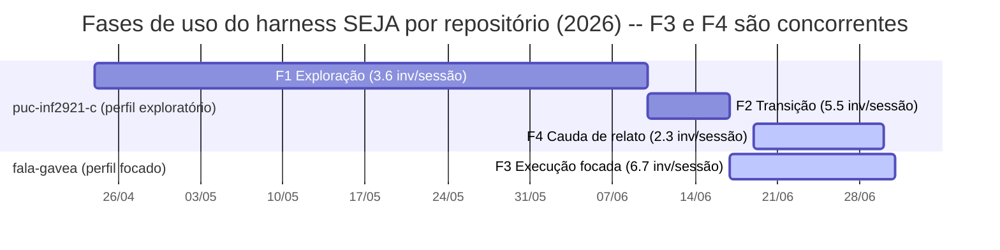

# Communication 000093 | ACD | 2026-07-07 19:21 | Fluxos comuns do developer com o harness SEJA

source: plan-000088 -- digest dos achados para colegas

---

## 1. Contexto

**Pergunta de pesquisa:** que fluxos de trabalho recorrentes emergem do uso prolongado de um harness de desenvolvimento assistido por agentes (SEJA), além do fluxo canônico `research -> plan -> implement`? **Método, em uma linha:** mineração do histórico de invocações de skills (briefs-index) de dois repositórios do mesmo desenvolvedor -- perfil exploratório (puc-inf2921-c, **96 invocações**, 24/abr a 30/jun) e perfil focado (fala-gavea, **120 invocações**, 17/jun a 1/jul), corpora congelados na janela da pesquisa -- com sessões definidas por corte de inatividade de até 3 horas e assinaturas de sessão com repetições consecutivas colapsadas. O fluxo canônico domina (`plan -> implement` é a transição mais frequente em todos os cortes), mas ele se especializa e se recombina em **cinco arquétipos recorrentes**, cuja distribuição distingue os dois perfis.

## 2. Os cinco arquétipos

| # | Arquétipo | Assinatura | Suporte verificado | Âncora (por ID) |
|---|---|---|---|---|
| 1 | Fluxo de bootstrap | `advise/research -> plan -> implement^n` | F1: 3 sessões iniciam com advise; `implement -> implement` 75% (6/8) | plan-000001 (tttc-poc), executado por steps em dias e máquinas diferentes |
| 2 | Execução por ondas de roadmap | `plan --roadmap -> (plan[item de onda] -> implement)^n` | **15 planos** do fala-gavea com `source:` apontando para roadmap (**8 com "Wave" explícito** na linha) + 4 no repo exploratório; `plan -> plan` 40% (8/20) em F2. O valor 12 da pesquisa original **não foi reproduzido** por nenhum critério testado | roadmap-000151 (3 ondas) -> planos 000152-000158 |
| 3 | Loop de grooming | `reflect -> (research\|plan) -> plan -> implement` | 11 reflections em F3; 8 seguidas de research (4) ou plan (4) na mesma sessão | reflection-000086 (inventário CRUD vs roadmap) |
| 4 | Micro-loop de feature | `(research -> plan -> implement)^n` na mesma sessão | P(plan\|research) = 70% (16/23) em F3, contra 33% em F2; trio repetido 2-4x por sessão | sessões de 21/jun e 26/jun no fala-gavea |
| 5 | Fluxo de relato | `research -> communicate` | `communicate -> research` 100% (2/2, n pequeno) em F3; F4 dominada por research 31% e communicate 25% | research-000087 -> plan-000088 -> este digest |

Arquétipos 1 e 5 pertencem ao regime exploratório/de relato; 2, 3 e 4 ao regime focado.

## 3. Achado central: F3 || F4 como controle intra-sujeito

As quatro fases não formam uma linha do tempo global única: F3 (execução focada, fala-gavea) e F4 (cauda de relato, puc-inf2921-c) transcorrem **nas mesmas semanas**, em repositórios distintos.

Versão textual (fallback):

| Período (2026) | Fase | Repositório | Invocações | Inv/sessão | Top skills |
|---|---|---|---|---|---|
| 24/abr - 10/jun | F1 Exploração | puc-inf2921-c | 25 | 3.6 | implement 48%, plan 28%, advise 12% |
| 10/jun - 17/jun | F2 Transição | puc-inf2921-c | 55 | 5.5 | plan 44%, implement 35%, research 13% |
| 17/jun - 1/jul | F3 Execução focada | fala-gavea | 120 | 6.7 | plan 34%, implement 25%, research 22% |
| 19/jun - 30/jun | F4 Cauda de relato | puc-inf2921-c | 16 | 2.3 | research 31%, communicate 25%, plan 19% |

> A sobreposição temporal F3 || F4 -- mesmo desenvolvedor, mesma versão do harness, mesmas semanas, perfis opostos (**6.7 vs 2.3 inv/sessão**) -- é o que permite afirmar que **o tipo de tarefa molda a forma do fluxo**, em vez de atribuir a diferença entre perfis a maturidade ou tempo de uso, que são confundidores colineares entre F1 e F3.

## 4. Papel duplo de /reflect

O achado qualitativo que conecta a taxonomia à comparação de perfis é que a mesma skill pode ocupar funções distintas em arquétipos distintos, e o caso mais nítido é `/reflect`: no perfil exploratório ela opera como captura livre de ideação e pivô (ex.: reflection-000052, registro de um pivô de escopo), enquanto no perfil focado opera como checkpoint periódico ancorado em artefatos, inventariando lacunas contra o roadmap e alimentando o loop de grooming (ex.: reflection-000086). Mesma skill, mesma interface, funções opostas -- válvula de mudança de direção em um regime, instrumento de manutenção de direção no outro. A diferença entre os perfis não está no vocabulário de skills, e sim na gramática com que o desenvolvedor as combina.

---

## Artefatos-fonte

- Taxonomia completa (5 arquétipos, regra de identificação): [taxonomia-arquetipos-fluxo.md](../2026-07-06/taxonomia-arquetipos-fluxo.md)
- Figura de timeline (gantt + fallback): [timeline-faixas-paralelas.md](../2026-07-06/timeline-faixas-paralelas.md)
- Pesquisa de origem: [research-000087](../../research-logs/research-000087-perfis-de-uso-do-harness-exploratorio-vs-focado.md)
- Plano executor: [plan-000088](../../plans/plan-000088-followups-research-087-taxonomia-arquetipos-timeline.md)
- Números verificados (corpus congelado 96/120): [taxonomia-support-counts.md](../../tmp/taxonomia-support-counts.md)

> Passe de privacidade (LGPD, Rec 3 research-000087, plan-000088 Step 4, 2026-07-06): aprovado -- exemplos referenciam artefatos por ID; nenhum nome de colega, citação verbatim de brief/reflection/WhatsApp ou conteúdo de relato cidadão presente. Este digest herda o passe dos artefatos-fonte.
